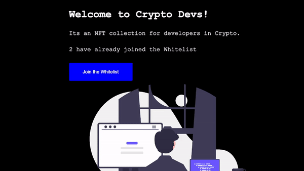

# LearnWeb3-First-dApp-Mood-Diary

---

## Project Description

This dApp allows users to join a whitelist to mint an NFT in the future. The white list is restricted to the first 10 addresses to sign up.

The front end is built with react and uses hardhat to connect to the goerli ethereum test net on the back end.

## License

This project's type license is MIT. You can find out more about this license [here](https://opensource.org/licenses/MIT).

## Demo

## Questions

You can find more of my work at [github.com/dansmith09](https://github.com/dansmith09)
Or view my portfolio at [dansmithdev.com.au](https://dansmithdev.com.au)

---

---

